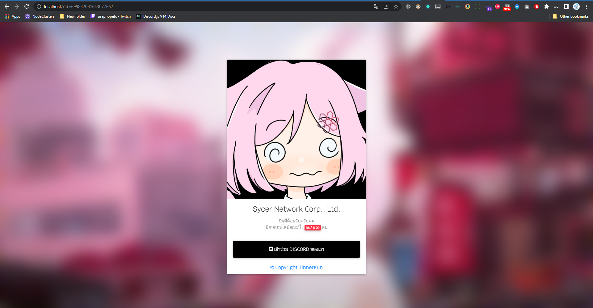

# Api Discord Invite [ Old Version ]

## วิธีการใช้ การใช้งาน
- เข้า Discord -> Setting -> Widget
- เปิด Enble Server Widget
- ปรับ Invite Channel เป็นอะไรก็ได้
- ก็อป Server ID
- เข้า https://cszteam.me/invite/?id=ใส่ไอดีตรงนี้
- เช่น ก็อปไอดี 823191030220324915 วิธีใช้ https://cszteam.me/invite/?id=823191030220324915
## การใช้ &r=
- ใช้ &r=1 คือ goto ไปยัง Discord Link Invite
- ใช้ &r=2 คือ Json Api
- ใช้ &r=3 คือ XML Api
- วิธีการใช้ https://cszteam.me/invite/?id=ใส่ไอดีตรงนี้&r=ตัวเลข เช่น https://cszteam.me/invite/?id=823191030220324915&r=1

# https://cszteam.me/invite/

ตอนนี้เวอร์ชันใหม่อยู่ที่ https://cszteam.me/api/api-invite.php ไปใช้งานกันได้เลยงับ
